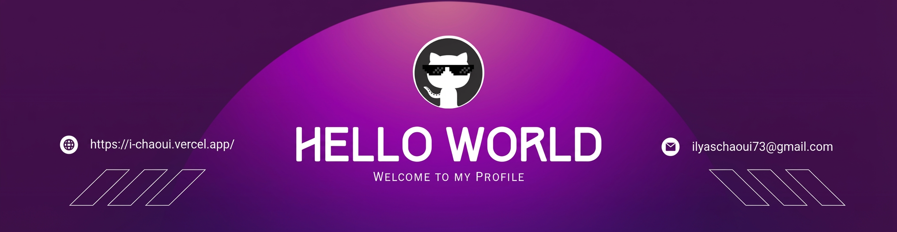

<!--Banner 
 
Note: You'll need to create your own banner image or remove this section-->

<!--Night Owl image-->

  

<!--Header Name-->
#  ɪ'ʟʏᴀs ᴄʜᴀᴏᴜɪ 
*Full Stack Developer | From Dental Medicine to Code*
  

<!--Start Intro-->               

I'm a passionate Full Stack Developer and freelancer, currently running my own agency <strong>Web Vision Agency</strong>. I thrive in collaborative environments and love building tailored solutions that make a difference.

- ✨ Student of life & code :)
- 🌱 I’m currently learning **Advanced NextJs & Spring Boot**
- 💼 Founder @ **Web Vision Agency** 
- 🎓 Alumni @ YouCode Safi | UMG6 (2023-2025)
- ⚡ Fun fact: **I transitioned from Dental Medicine to Web Development!**
- 💻 Check my [Portfolio](https://i-chaoui.vercel.app) for more details
- 📫 How to reach me: **ilyaschaoui73@gmail.com**
<!--End Intro-->

<!--Profile Count Badge-->

  

---

<!--Languages and Tools Section-->       
<h2 align="center">💻 Tᴇᴄʜ sᴛᴀᴄᴋ & ᴛᴏᴏʟs 💻</h2> 

<h3 align="left">Frontend Development</h3>

  
  
  
  
  
  
  
  
  
  
  
  
  
  
  
  
  

<h3 align="left">Backend Development</h3>

  
  
  
  
  
  
  
  
  
  
  

<h3 align="left">Tools & Technologies</h3>

  
  
  
  
  
  
  
  
  
  
  
  
  

 

<h3 align="left">📌 Current Learning</h3>
<ul align="left">
  <li>Deepening my knowledge in Advanced React patterns</li>
  <li>Exploring Spring Boot for robust backend development</li>
  <li>Improving my skills in cloud deployment and DevOps</li>
</ul>

 

<!--Github stats Table--> 
<h2 align="center">📊 Gɪᴛʜᴜʙ Sᴛᴀᴛs 📊</h2>

<table width="100%">
  <tr>
    <td width="50%">
      <h3 align="center"><strong>Gɪᴛʜᴜʙ Sᴛᴀᴛs</strong></h3>
      

        
      

    </td>
    <td width="50%">
      <h3 align="center"><strong>Sᴛʀᴇᴀᴋ Sᴛᴀᴛs</strong></h3>
      

        
      

    </td>
  </tr>
  <tr>
    <td width="50%">
      <h3 align="center"><strong>Lᴀɴɢᴜᴀɢᴇs</strong></h3>
      

        
      

    </td>
    <td width="50%">
      <h3 align="center"><strong>Cᴏɴᴛʀɪʙᴜᴛɪᴏɴs</strong></h3>
      

        
      

    </td>
  </tr>
</table>
 

<!--Contribution Graph-->
<h2 align="center">📈 Cᴏɴᴛʀɪʙᴜᴛɪᴏɴ Gʀᴀᴘʜ 📈</h2>

    

---

<!--Dynamic Quote card updates everyday at 12 PM--> 
<h2 align="center">🌟 Tʜᴏᴜɢʜᴛ ᴏғ ᴛʜᴇ Dᴀʏ 🌟</h2>

<!--STARTS_HERE_QUOTE_CARD-->

    

<!--ENDS_HERE_QUOTE_CARD-->

<!--Contact Section--> 
<h2 align="center">🤝 Cᴏɴɴᴇᴄᴛ Wɪᴛʜ Mᴇ 🤝</h2>

 

<!--Location & Contact-->

  

    <strong>📍 Casablanca, Morocco</strong> 
    <strong>📞 +212 602393795</strong>
  

<!--Buy me a coffee 

-->

<!--Footer--> 

  

